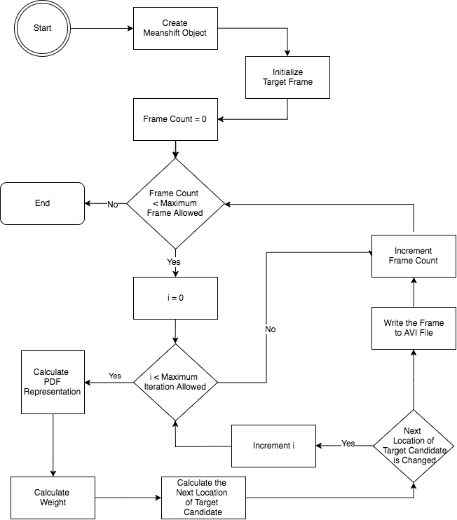
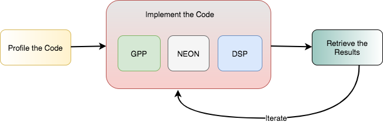
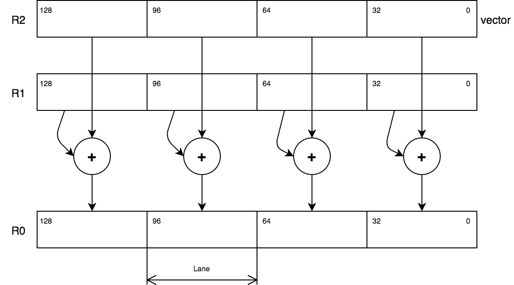
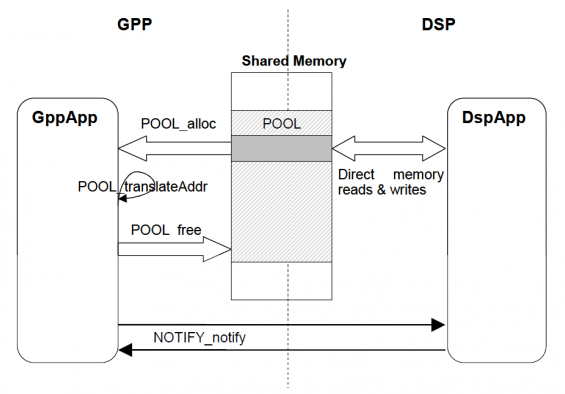
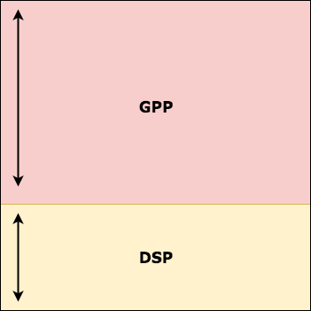
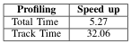

# Mean Shift Tracking Optimization in Beagleboard Rev C4 # 

In this paper, a mean shift algorithm source code based on these papers [1](https://ieeexplore.ieee.org/document/1195991), [2](https://dl.acm.org/doi/10.1016/j.cviu.2009.12.006), [3](https://dl.acm.org/doi/abs/10.5555/1082121.1082122) was provided. The application works by tracking an object (car) in a video. The task is optimizing the application at least 4 times faster for the total execution time and 16 times faster for tracking part. Several optimizations will be applied to this algorithm and explained in the next section. 

Mean shift algorithm is the algorithm that tracks the moving object by measuring the location of an image region which is closest to the reference color histogram of the target region on each frame. The flowchart of mean shift algorithm is shown on Figure below. 

### Methods ###

The methodology for developing the program is shown by Figure below. In order to optimize the program, the first step is profiling the original code. Afterward, the process is continued by iterating the optimization, followed by result verification or testing. During the first iteration, the implementation is focused on optimizing the code on GPP side. Then, after the bottleneck is detected, the next focus is NEON implementation on that part of code or the bottleneck. In the cycle, the biggest bottleneck on the code after implementing some optimization will be optimized again by utilizing DSP. In this iteration, the load balancing between the implementation between GPP and DSP was done.

1. **Neon Implementation**. The idea of using multiple data with the single instruction (SIMD) can be utilized using NEON instruction, especially in calculating the weight as it is the most intensive method in Mean Shift. Also, NEON is used to calculate the bin value and the next target region. Because NEON can perform 128 bit and the data type is float (32 bit), four data with size of 32 bit can be computed at the same time. Figure below illustrates a 4-way 32 bit addition in NEON.

2. **DSP Implementation**. 

In this project, 2 DSP is also utilized to help the work of GPP and NEON. The concept that we used in pool-notify. To see how it works better, you can see the image below. Shared memory is utilized to storing the input needed by DSP for the calculation and output data as the result of the calculation itself.

In our implementation, DSP is used to calculate the PDF representation, hoping to ease the workload of GPP side, since the NEON is not utilized to calculate PDF. The split of the calculation is done based on how many rows that want to be computed in DSP. The number of how many rows that will be computed in DSP can be configured through an argument when starting the program. Figure below shows how the task division between DSP and GPP.

### Results ###

The result of our DSP and NEON implementation is shown in table below.

### Conclusion ###

This report investigates how to achieve performance optimization for the mean shift algorithm on Beagleboard. It started by exploiting all the available hardware resources (NEON, GPP and DSP), and assigning intensive tasks to the dedicated hardware. The results showed that the execution time of the mean shift has greatly being improved, and be able to achieve 32 times speedup of the tracking, and 5.5 times the total speedup. Using only NEON to calculate the weight can significantly improve the performance with the tracking speed up of 27 times and 5 times total time as it has the feature of SIMD, but the workload of the algorithm can be split to GPP and DSP. The PDF representation is calculated on DSP which is really good at manipulating integers. The DSP can be optimized by applying the idea of software pipelining which optimizes the loop by unrolling loop, and hence it can save some cycles. Also, the hardware units are utilized in both sides A and B. 
